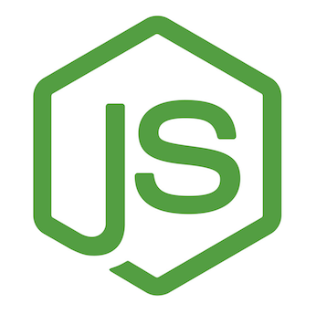

# express-mysql-with-docker

# Getting started

To get the Node server running locally:

- Clone this repo
- `docker-compose up` to start the local server

## Dependencies

- [ExpressJS](https://github.com/expressjs/express) - The server for handling and routing HTTP requests
- [MySQL](https://github.com/mysql/mysql-docker) - For modeling and mapping MongoDB data to javascript 

## Application Structure

- `server.js` - The entry point to our application. This file defines our express server and connects it to MySQL. It also requires the routes and models we'll be using in the application.
- `config/` - This folder contains configuration  location for environment variables.
- `routes/` - This folder contains the route definitions for our API.
- `models/` - This folder contains the schema definitions for our MySQL models.

#POSTMAN
- `REST_API_TEST.postman_collection.json`

License
-------
MIT License
